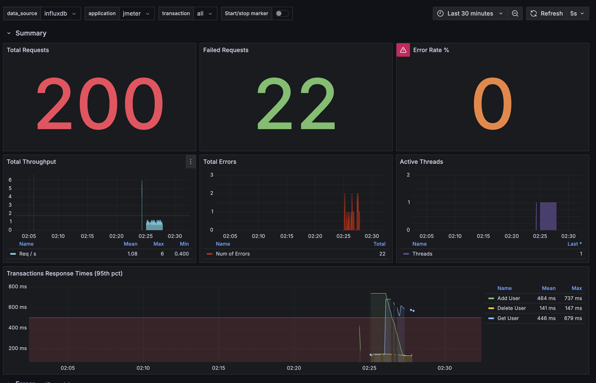

# Performance Testing Practice

## Pre-requisites
- Docker
- Docker Compose
- JMeter

## Running Headless JMeter from Command Line

```bash
jmeter -n -t ./petstore.jmx -l ./results.jtl
```

## Running Grafana

```bash
docker-compose up -d
```

## Accessing Grafana

Once the containers are running, you can access Grafana at:
- URL: http://localhost:4000
- Username: admin
- Password: admin (or the value set in GF_ADMIN_PASSWORD environment variable)

## Configuing Grafana with InfluxDB
To configure Grafana with InfluxDB, follow these steps:

1. Open Grafana at http://localhost:3000
1. Go to Connections -> Data Sources, search for InfluxDB
1. Set:
    ```
    URL = http://influxdb:8086
    Database = jmeter
    User = admin
    Password = super-secret-token
    ```

## Adding a Jmeter Grafana Dashboard

To import JMeter Grafana dashboard, follow these steps:
1. Go to Dashboards -> New -> Import
1. Input `4026` and click Load



